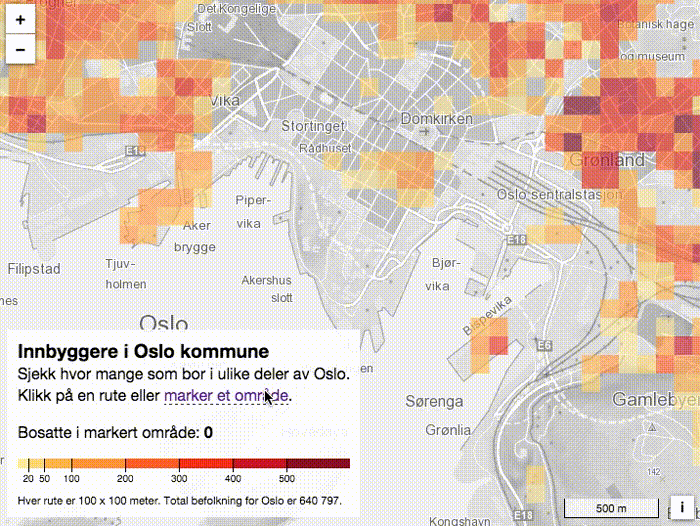
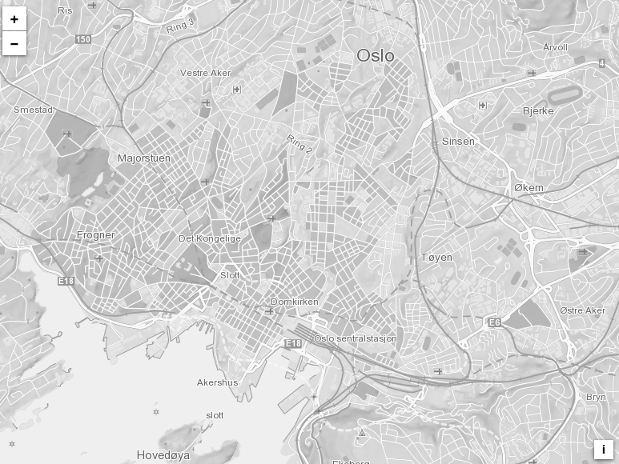
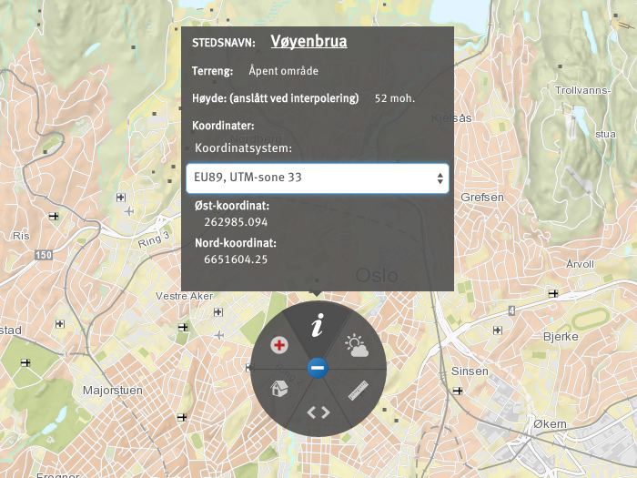
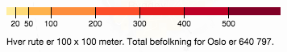
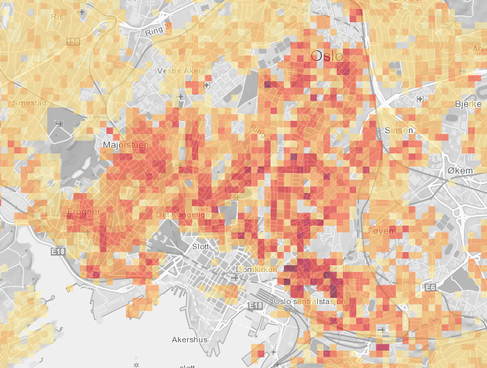
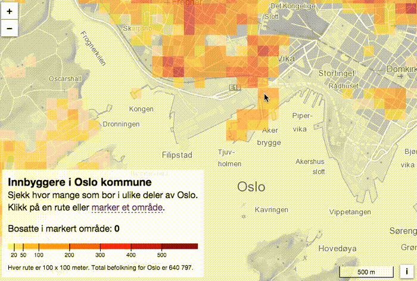
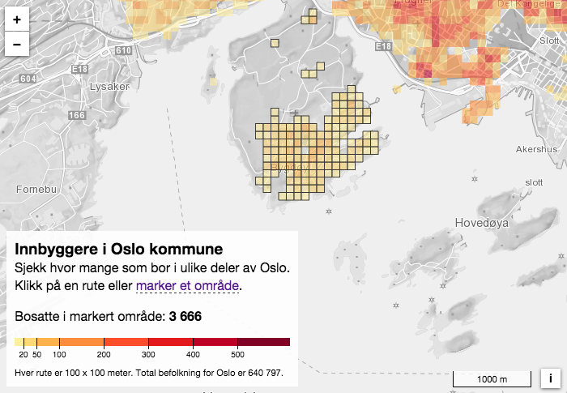

# Befolkningsdata på rutenett

Laget av <a href="http://mastermaps.com/">Bjørn Sandvik</a>

<a href="http://www.ssb.no/">Statistisk sentralbyrå (SSB)</a> har <a href="https://www.ssb.no/statistikkbanken">en rekke statistikker</a> som egner seg til visning på kart. Det vanligste er å koble statistikk til områder som fylker, kommuner eller <a href="http://kartverket.no/Kart/Kartdata/Grenser/Produktark-for-grunnkretser/">grunnkretser</a>, og hvordan du kan koble statistikk til administrative eller statistiske enheter er forklart i <a href="https://github.com/GeoForum/veiledning02">veiledning 2</a>. Her skal vi derimot se på annen type visualisering på kart; statistikk på rutenett. 

[](http://geoforum.github.io/veiledning08/)

Bildet over viser kartet vi skal lage. Vi skal legge befolkningsdata i ruter på 100 x 100 meter oppå bakgrunnskart fra Kartverket. Brukeren kan selv markere et område for å se antall innbyggere. I Oslo har det vært stor diskusjon rundt bilfritt sentrum, og med dette kartet kan du selv se hvor mange personer som bor i de berørte områdene. 

<a href="http://geoforum.github.io/veiledning08/">Gå til det ferdige kartet</a>

### Hvorfor statistikk på rutenett?
Det er utviklet en <a href="https://www.ssb.no/natur-og-miljo/artikler-og-publikasjoner/statistical-grids-for-norway">nasjonal standard for statistikk på rutenett</a>. Et standardisert rutenett gjør det enklere å sammenstille data fra ulike kilder. Rutenettet kan være grovt, som 5 x 5 km, eller finmasket med 100 x 100 meter som er brukt i dette eksempelet. Av personvernhensyn får du kun tak i befolkningsdata ned til 250 x 250 meter for hele landet, men det er mulig å få tak i mer detaljerte data for Oslo.  

Statistikk på rutenett kan gjøre geografiske analyser enklere. Her kan du lese <a href="https://nrkbeta.no/2015/06/25/slik-undersokte-nrk-radonkartene/">hvordan NRK brukte SSB-data på rutenett for å finne befolkning og bygningsmasse i områder med høy radonfare</a>. Tilsvarende kan befolkningsdata brukes til å analysere kundegrunnlaget for butikker, finne beste lokalisering av holdeplasser eller dekningsgrad for mobiltelefoni. Rutenett vil ofte vil være mer detaljert enn andre enheter som kommuner og bydeler, og bedre egnet til å vise endringer over tid siden rutenettet ikke påvirkes av kommunesammenslåinger etc. 
  
### OpenLayers med bakgrunnskart fra Kartverket
Rutenettet fra SSB er i kartprojeksjonen UTM 33N som du kan lese mer om i <a href="https://github.com/GeoForum/veiledning05">veiledning 5</a>. For å sikre at rutene vises rett skal vi bruke samme projeksjon i vårt kart. Kartverket tilbyr <a href="http://kartverket.no/Kart/Gratis-kartdata/Cache-tjenester/">flere kart</a> i denne projeksjonen, og de har også lagt ut <a href="https://github.com/kartverket/example-clients">eksempler på bruk for ulike verktøy</a>. Her skal vi bruke <a href="http://openlayers.org/">OpenLayers 3</a>, som er blant kartbibliotekene med best støtte for ulike projeksjoner.  

[](http://geoforum.github.io/veiledning08/kartverket.html)

<a href="http://geoforum.github.io/veiledning08/kartverket.html">Kartet over</a> heter "Norges grunnkart gråtone" blir lasta direkte fra Kartverkets servere. Det er valgt gråtoner for at befolkningsdataene skal komme tydligere frem. 

Vi må legge til en definisjon av UTM 33N for at den skal støttes av OpenLayers. Denne <a href="https://github.com/MasterMaps/OpenLayers.UTM33N">definisjonen finner du her</a>, og <a href="https://github.com/MasterMaps/OpenLayers.UTM33N/blob/master/ol.proj.UTM33N.js">scriptet</a> lastes inn etter OpenLayers-biblioteket. Vi får da støtte for UTM-koordinater i OpenLayers:

```javascript
var epsgCode = 'EPSG:32633', // UTM 33N
    projection = ol.proj.get(epsgCode),
    projectionExtent = projection.getExtent(),
    size = ol.extent.getWidth(projectionExtent) / 256,
    resolutions = [],
    matrixIds = [];

for (var z = 0; z <= 13; ++z) {
    resolutions[z] = size / Math.pow(2, z);
    matrixIds[z] = epsgCode + ':' + z;
}

var map = new ol.Map({
    target: 'map',
    layers: [
        new ol.layer.Tile({
            title: 'Norges grunnkart',
            source: new ol.source.WMTS({
                url: 'http://opencache.statkart.no/gatekeeper/gk/gk.open_wmts?',
                layer: 'norges_grunnkart_graatone',
                matrixSet: epsgCode,
                format: 'image/png',
                projection: projection,
                tileGrid: new ol.tilegrid.WMTS({
                    origin: ol.extent.getTopLeft(projection.getExtent()),
                    resolutions: resolutions,
                    matrixIds: matrixIds
                }),
                attributions: [new ol.Attribution({
                    html: '<a href="http://kartverket.no/">Kartverket</a>'
                })]
            })
        })
    ],
    view: new ol.View({
        projection: projection,
        center: [262985, 6651604],
        zoom: 11,
        minZoom: 8,
        maxZoom: 13
    })
});
```

Kort forklaring av <a href="https://github.com/GeoForum/veiledning08/blob/gh-pages/js/kartverket.js">koden</a> over:
- "<a href="http://epsg.io/32633">EPSG:32633</a>" er en standardisert måte å angi UTM 33N på. 
- Vi laster inn bakgrunnskartet "norges_grunnkart_graatone" som <a href="http://kartverket.no/Kart/Gratis-kartdata/Cache-tjenester/">pregenererte kartfliser</a> (tiles på engelsk) på 256x256 pixler i definerte målestokker (resolutions).
- Til slutt definerer hva som skal være utgangsposisjonen i kartet i form av et senterpunkt og et zoomnivå. Senterpunktet er angitt med UTM 33-koordinater  

[](http://norgeskart.no/)

Tips: Du kan finne UTM 33-koordinater på <a href="http://norgeskart.no/">Norgeskart.no</a>. Klikk et sted i kartet og videre på i-symbolet. 

### Hvordan lage et rutenett? 

Hos SSB kan du laste ned både rutenett og statistikk som kan <a href="<https://github.com/GeoForum/veiledning02/blob/master/join.md">kobles sammen</a> med en felles id. Vi kan også lage dette rutenettet selv direkte i nettleseren, noe som gir en mye raskere dataoverføring. 

Rutenettstatistikken fra SSB kan lastes ned som CSV-filer: 
 
```
rute_100m sum
22536006661600 9
22536006661700 7
22536006662000 7
22538006662300 16
22538006662700 12
22539006662300 5
... 
```

Her inneholder første kolonne id'er til hver rute, og andre kolonne angir hvor mange som bor innenfor ruta. For å lese disse dataene kan vi bruke biblioteket <a href="http://d3js.org/">D3.js</a> som inneholder en rekke nyttige funksjoner for datavisualisering.

```javascript
// Angi tegn som skiller kolonner
var csv = d3.dsv(' ', 'text/plain');

// Les og konverter til JavaScript-array
csv('data/Oslo_bef_100m_2015.csv').get(function(error, data) {
    ...
});
```

Vi angir først hvilket tegn (mellomrom) som skiller kolonnene. Etter at dataene er lest inn, konverteres de til en JavaScript-array i dette formatet: 

```
[{
  rute_100m: "22536006661600"
  sum: "9"
},{
  rute_100m: "22536006661700"
  sum: "7"
},{
...
}]
```

Id'en på 14 siffer innholder koordinatene til det sørvestre hjørnet til ruta, og vi kan bruke denne informasjonen til å lage et rutenett i et format som OpenLayers forstår. Vi bruker her <a href="http://geojson.org/">GeoJSON</a> som er mye brukt for webbaserte kart. 

```javascript
var geojson = ssbgrid2geojson(data, 100, 'rute_100m');

function ssbgrid2geojson (data, size, ssbid) {
    var points = {
        type: 'FeatureCollection',
        features: []
    };

    data.forEach(function(d){
        var id = d[ssbid],
            x = parseInt(id.substring(0, 7)) - 2000000, 
            y = parseInt(id.substring(7, 14)); 

        points.features.push({
            type: 'Feature',
            id: id,
            properties: d,
            geometry: {
                type: 'Point',
                coordinates: [x + size / 2, y + size / 2]
            }
        });
    });

    return points;
}
```

Koden over genererer GeoJSON-data fra SSB-data. De 7 første sifferene minus 2 000 000 (<a href="https://www.ssb.no/natur-og-miljo/artikler-og-publikasjoner/statistical-grids-for-norway">les hvorfor her</a>) angir x-koordinatet, mens de siste 7 sifferene er y-koordinatet i UTM 33. Vi lager et punkt for hver rute hvor vi plasserer koordinatet i midten. Her kunne vi også returnert et firkanta polygon for hver rute, men vi velger å lage disse på en annen måte. 
  
[](http://geoforum.github.io/veiledning08/geojson.html)  

OpenLayers vil <a href="http://geoforum.github.io/veiledning08/geojson.html">vise rutenettet på denne måten</a>, hvis vi ikke angir hvordan hver rute skal se ut. Dette er koden som lager kartet over:

```javascript
var grid = new ol.source.Vector({
    features: (new ol.format.GeoJSON()).readFeatures(geojson),
    attributions: [new ol.Attribution({
        html: '<a href="http://ssb.no/">SSB</a>'
    })]
});

var gridLayer = new ol.layer.Vector({
    source: grid
});

map.addLayer(gridLayer);
```

Vi oppretter her et ny datakilde basert på våre GeoJSON-data, og legger dette til kartet. Det vil vises oppå bakgrunnskartet fra Kartverket. 

### Fargeskala med D3.js

Vi kan bruke D3.js til å lage en fargeskala fra gul til rød for å angi høyere befolkningstetthet:

```javascript
var colorScale = d3.scale.threshold()
    .domain([20, 50, 100, 200, 300, 400, 500]) 
    .range(['#FFEDA0', '#FED976', '#FEB24C', '#FD8D3C', '#FC4E2A', '#E31A1C', '#BD0026', '#800026']);
```
    
Vi bruker her skala basert på terskler (threshold) slik at alle verdier innenfor et intervall får samme farge. Vi bruker også D3 til å lage en tegnforklaring basert på vår fargeskala:



```javascript
function createLegend (colorScale) {
    var x = d3.scale.linear()
        .domain([0, 617])
        .range([0, 340]);

    var xAxis = d3.svg.axis()
        .scale(x)
        .orient('bottom')
        .tickSize(14)
        .tickValues(colorScale.domain());

    var svg = d3.select('svg.legend');

    svg.selectAll('rect')
        .data(colorScale.range().map(function(color) {
            var d = colorScale.invertExtent(color);
            if (d[0] == null) d[0] = x.domain()[0];
            if (d[1] == null) d[1] = x.domain()[1];
            return d;
        }))
        .enter().append('rect')
        .attr('height', 10)
        .attr("x", function(d) { return x(d[0]); })
        .attr('width', function(d) { return x(d[1]) - x(d[0]); })
        .style('fill', function(d) { return colorScale(d[0]); });

    svg.call(xAxis);
}
```

Vi kan nå fargelegge rutene i kartet gjennom en funksjon som kalles for hvert punkt eller rad i datasettet fra SSB: 
     
```javascript     
var gridStyle = function (feature) {
    var coordinate = feature.getGeometry().getCoordinates(),
        x = coordinate[0] - gridSize / 2,
        y = coordinate[1] - gridSize / 2,
        pop = parseInt(feature.getProperties().sum),
        rgb = d3.rgb(colorScale(pop));

    return [
        new ol.style.Style({
            fill: new ol.style.Fill({
                color: [rgb.r, rgb.g, rgb.b, 0.6]
            }),
            geometry: new ol.geom.Polygon([[
                [x,y], [x, y + gridSize], [x + gridSize, y + gridSize], [x + gridSize, y]
            ]])
        })
    ];
};   
  
var gridLayer = new ol.layer.Vector({
    source: grid,
    style: gridStyle
});  
```  

Til denne funksjonen sendes det inn et GeoJSON-punkt som koordinater og befolkningsverdi hentes fra. Disse brukes videre til å tegne et firkanta polygon for hver rute med farge basert på verdien. Rutene er også gjort gjennomsiktige slik at vi kan skimte bakgrunnskartet igjennom. Dette gjør det lettere å orientere seg, men det fører også at fargene ikke stemmer helt med tegnforklaringen. Et alternativ vil være å vise veier og stedsnavn oppå rutenettet. 



### Markering av ruter i kartet

Til slutt skal vi gjøre det mulig å markere et område for å se hvor mange som bor innenfor disse rutene. De valgte rutene vises med en svart ramme rundt rutene hvor tykkelsen varierer med zoomnivå (resolution): 

```javascript 
// gridSelectStyle
stroke: new ol.style.Stroke({
  color: '#333',
  width: 10 / resolution
})
```  

Dette er koden som kreves for å velge ruter ved å klikke på dem: 

```javascript 
var gridSelect = new ol.interaction.Select({
  style: gridSelectStyle
});

var selectedGridCells = gridSelect.getFeatures();

selectedGridCells.on('add', function (feature) {
    population += parseInt(feature.element.getProperties().sum);
    showPopulation(population);
});

selectedGridCells.on('remove', function (feature) {
    population -= parseInt(feature.element.getProperties().sum);
    showPopulation(population);
});

map.addInteraction(gridSelect);
```  

Hver gang en rute legges til eller fjernes vil befolkningsverdien oppdateres og vises til brukeren. 

[](http://geoforum.github.io/veiledning08/)

Hold shift-tasten nede for å velge flere ruter. 

For å kunne markere et større område kan vi bruke tegneverkøyet i OpenLayers: 

```javascript 
var draw = new ol.interaction.Draw({
    type: 'Polygon'
});

draw.on('drawstart', function (evt) {
    selectedGridCells.clear();
});

draw.on('drawend', function (evt) {
    var geometry = evt.feature.getGeometry(),
        extent = geometry.getExtent(),
        drawCoords = geometry.getCoordinates()[0];

    grid.forEachFeatureIntersectingExtent(extent, function(feature) {
        if (pointInPolygon(feature.getGeometry().getCoordinates(), drawCoords)) {
            selectedGridCells.push(feature);
        }
    });
});

function pointInPolygon (point, vs) {
    var x = point[0], y = point[1];

    var inside = false;
    for (var i = 0, j = vs.length - 1; i < vs.length; j = i++) {
        var xi = vs[i][0], yi = vs[i][1];
        var xj = vs[j][0], yj = vs[j][1];

        var intersect = ((yi > y) != (yj > y)) && (x < (xj - xi) * (y - yi) / (yj - yi) + xi);
        if (intersect) inside = !inside;
    }

    return inside;
}
```  

Her oppretter vi et tegneverktøy for å markere vilkårlige områder (polygoner) i kartet. Når et område er markert henter vi først ut ruter som er innenfor en tenkt firkant rundt polygonet (extent). For å finne de faktiske rutene hvor senterpunktet er innenfor polygonet bruker vi videre en <a href="https://github.com/substack/point-in-polygon">"punkt-i-polygon" funksjon</a>. 

[](http://geoforum.github.io/veiledning08/)

Vi er nå <a href="http://geoforum.github.io/veiledning08/">ferdige med kartet</a>, og den fullstendige JavaScript-koden <a href="https://github.com/GeoForum/veiledning08/blob/gh-pages/js/map.js">finner du her</a>. I neste veiledning bruker vi det samme datasettet til å lage en <a href="https://github.com/GeoForum/veiledning09">3D-visualisering av befolkningen i Oslo</a>. 